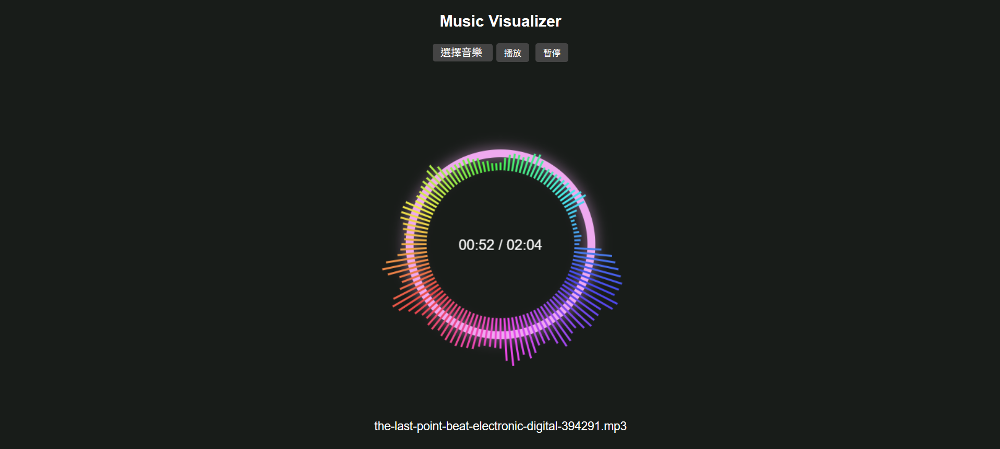

# 🎵 Music Visualizer — 網頁版音樂視覺化工具

基於 **Web Audio API** 與 **Canvas API** 製作的音樂視覺化網頁。  
使用者可以上傳音樂檔案，並即時查看根據頻率變化的圓形動態視覺效果。

以 vibe coding 的方式進行開發，透過與 ChatGPT 對話來完成。

---

## 📸 Demo
 

---

## ✨ 功能特色

- 📁 支援本地音樂檔案上傳（MP3 / WAV 等）
- 🔊 使用 Web Audio API 分析頻率與音量
- 🎨 圓形頻譜動畫，會隨音樂節奏律動
- 🌈 背景顏色會依照音樂動態緩慢變化
- ⭕ 中央顯示「播放時間 / 總時長」
- 💡 自適應畫面大小（Responsive Canvas）
- ▶️ 提供播放 / 暫停按鈕

---

## 🚀 使用方式

部署於 Github Pages，請直接訪問: https://owen-c-406.github.io/cloud-midterm/

---

## 🛠️ 使用技術

- HTML5  
- CSS3  
- JavaScript  
- Web Audio API  
- Canvas API  

---

## 🎵 Sample Music

此專案包含範例音樂：

**檔名：** `the-last-point-beat-electronic-digital-394291.mp3`  
**來源：** Pixabay Music  
**來源網址：** https://pixabay.com/music/

---

## 🙌 感謝使用

如果這個 Music Visualizer 有幫助到你，歡迎給個 ⭐ 支持這個專案！
